# Getting Started with Kubeflow - Cognito Authentication

Kubeflow is a scalable ML platform that runs on Kubernetes which aims to make organization AI possible while maintaining quality of control.

In this post we will explore how to setup a production read Kubeflow cluster that leverages Amazon Cognito as its authentication provider

## Requirments

* [AWS CLI Setup](https://aws.amazon.com/cli/) and configured
* [kubectl](https://kubernetes.io/docs/tasks/tools/install-kubectl/)
    ```bash
    $ sudo curl --silent --location -o /usr/local/bin/kubectl https://amazon-eks.s3-us-west-2.amazonaws.com/1.14.6/2019-08-22/bin/linux/amd64/kubectl
    $ sudo chmod +x /usr/local/bin/kubectl
    ```
* [aws-iam-authenticator](https://docs.aws.amazon.com/eks/latest/userguide/install-aws-iam-authenticator.html)
    ```bash
    $ sudo curl --silent --location -o /usr/local/bin/aws-iam-authenticator https://amazon-eks.s3.us-west-2.amazonaws.com/1.15.10/2020-02-22/bin/linux/amd64/aws-iam-authenticator
    $ sudo chmod +x /usr/local/bin/aws-iam-authenticator
    ```
* [eksctl](https://eksctl.io/introduction/installation/)
    ```bash
    $ curl --silent --location "https://github.com/weaveworks/eksctl/releases/latest/download/eksctl_$(uname -s)_amd64.tar.gz" | tar xz -C /tmp
    $ sudo mv -v /tmp/eksctl /usr/local/bin
    ```
* [kfctl](https://github.com/kubeflow/kfctl)
    ```bash
    $ curl --silent --location "https://github.com/kubeflow/kfctl/releases/download/v1.0.1/kfctl_v1.0.1-0-gf3edb9b_linux.tar.gz" | tar xz -C /tmp
    $ sudo mv -v /tmp/kfctl /usr/local/bin
    ```
* Custom domain for use with Cognito. **Must be registered (or at least delegated for use) through Route53** for this purpose of this guide

## Cognito

For the cognito portion of this guide we'll be making use of a pre-baked template by [Eric Johnson](https://gist.github.com/singledigit) that creates the entire backend provider from one [CloudFormation template](https://gist.github.com/singledigit/2c4d7232fa96d9e98a3de89cf6ebe7a5).

Run the following command from our project repo to deploy the stack.

```bash
aws cloudformation create-stack \
    --stack-name "eks-kubeflow-cognito" \
    --template-body file://eks-kubeflow-cognito.yaml \
    --capabilities CAPABILITY_IAM \
    --region us-west-2
```

> Later in this tutorial you will need to retrieve the Cognito details from the CloudFormation stack. This is done by using the `aws cloudformation describe-stacks` CLI command.

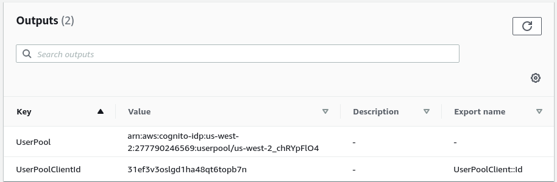

### Domain Setup (ACM)

For the purpose of this guide we also need to ensure that Cognito is using our custom domain. For this process navigate to [AWS Certificate Manager (ACM) in us-east-1](https://console.aws.amazon.com/acm/home?region=us-east-1) and request a new certificate.

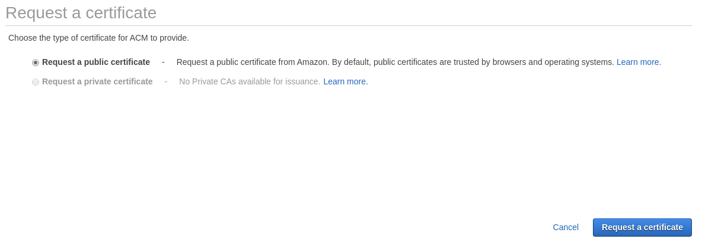

In my case I'll be using the domain `auth.devopstar.com`

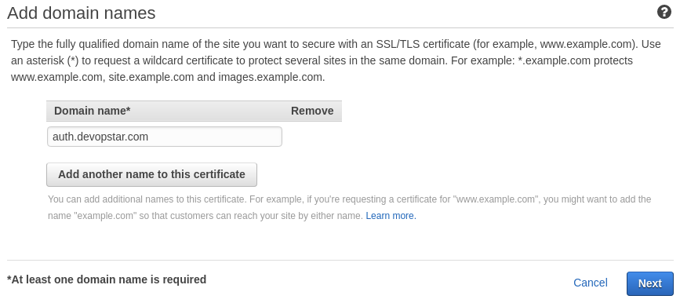

Click DNS validation unless you are comfortable handling Email validation. Then click through the rest of the process clicking `Confirm and request`.

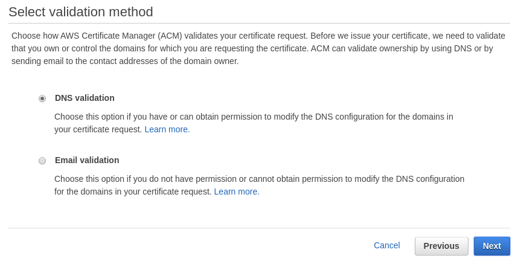

Confirm the domain using DNS validation by clicking `Create record in Route53`.

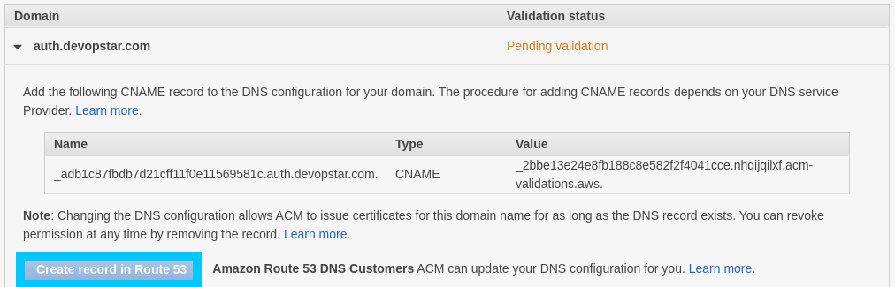

Before continuing to the next step, take note of the Certificate ARN

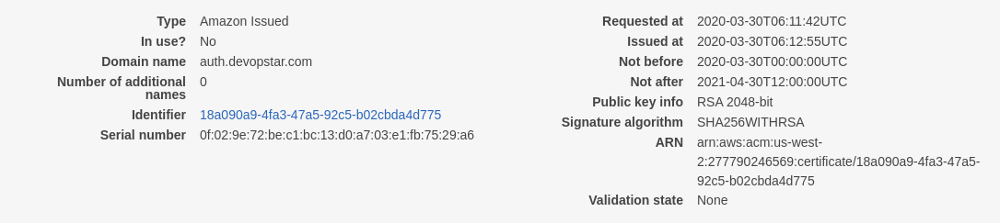

> NOTE: Take note of the ARN somewhere where we can use it later, in my case I'll export it as an environment variable

```bash
export AWS_ACM_CERT_ARN=arn:aws:acm:us-east-1:XXXXXXXXXXXX:certificate/5cde2e53-8f1b-44c1-920b-6556dc868239
```

### Domain Setup (Cognito)

Now that the certificate is validated head over to the Amazon Cognito console **in the us-west-2 region**.

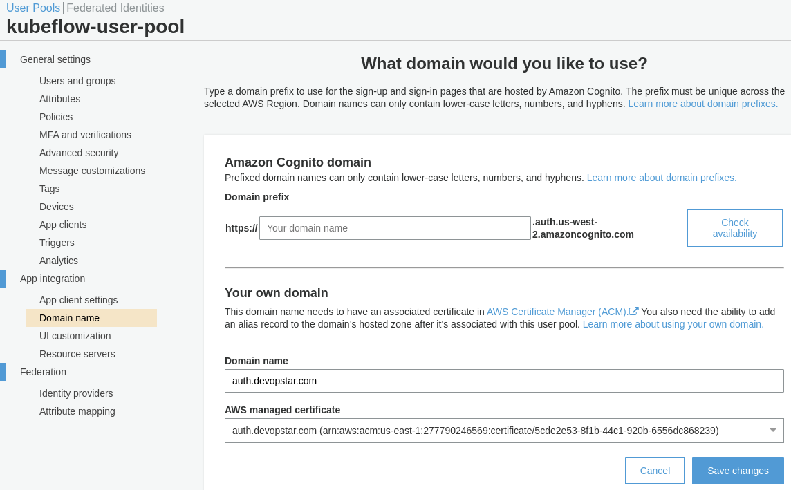

Finally head over to Route53 and under your domain (in my case devopstar.com) create an Alias A record with the CloudFront entry provided in the previous setup

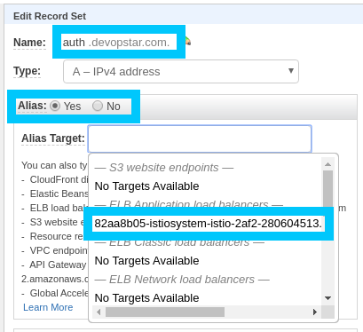

We can now move onto setting up our EKS cluster. **Note** *that we will keen to come back to update the callback URL for the cognito app later on in the tutorial.*

## EKS Setup

Create new EKS cluster using the eks config file in the demo repository

```bash
eksctl create cluster -f eks-kubeflow-cluster.yaml
```

## Kubeflow

### Setup

> **NOTE:** Make sure you have set `AWS_ACM_CERT_ARN` with the certificate ARN from ACM

```bash
export AWS_ACM_CERT_ARN=arn:aws:acm:us-east-1:XXXXXXXXXXXX:certificate/5cde2e53-8f1b-44c1-920b-6556dc868239
```

Make changes to the Kubeflow configuration using the following commands

```bash
source ./eks-kubeflow-install.sh

# Create the Kubeflow setup directory
mkdir -p ${KF_DIR} && cd ${KF_DIR}

# Download the config file
wget -O kfctl_aws.yaml $CONFIG_URI

# Replace existing info with your setup
# sed -i '/region: us-west-2/ a \      enablePodIamPolicy: true' ${CONFIG_FILE}
sed -i -e 's/kubeflow-aws/'"$AWS_CLUSTER_NAME"'/' ${CONFIG_FILE}
sed -i "s@us-west-2@$AWS_REGION@" ${CONFIG_FILE}

# Disable IAM roles
# sed -i "s@roles:@#roles:@" ${CONFIG_FILE}
sed -i "s@eksctl-eks-kubeflow-nodegroup-ng-a2-NodeInstanceRole-xxxxx@$AWS_CLUSTER_NODE_ROLE@" ${CONFIG_FILE}

# Cognito Details
sed -i "s@arn:aws:acm:us-west-2:xxxxx:certificate/xxxxxxxxxxxxx-xxxx@$AWS_ACM_CERT_ARN@" ${CONFIG_FILE}
sed -i "s@xxxxxbxxxxxx@$COGNITO_CLIENT_APP_ID@" ${CONFIG_FILE}
sed -i "s@arn:aws:cognito-idp:us-west-2:xxxxx:userpool/us-west-2_xxxxxx@$COGNITO_USER_POOL@" ${CONFIG_FILE}
sed -i "s@your-user-pool@$COGNITO_AUTH_DOMAIN@" ${CONFIG_FILE}
```

To check that things have worked open up the `eks-kubeflow/kfctl_aws.yaml` template and confirm you have a block similar to the following at the bottom (with your personal account ID present).

```yaml
  plugins:
  - kind: KfAwsPlugin
    metadata:
      name: aws
    spec:
      auth:
        cognito:
          certArn: arn:aws:acm:us-east-1:xxxxxxxxxxxxx:certificate/5cde2e53-8f1b-44c1-920b-6556dc868239
          cognitoAppClientId: 4coatq7l46irmkacnohbgjpom2
          cognitoUserPoolArn: arn:aws:cognito-idp:us-west-2:xxxxxxxxxxxxx:userpool/us-west-2_Izsf6MKFn
          cognitoUserPoolDomain: auth.devopstar.com
      region: us-west-2
      roles:
      - "arn:aws:iam::xxxxxxxxxxxxx:role/eksctl-eks-kubeflow-nodegroup-nod-NodeInstanceRole-1AV291G6VREQL"
```

### Deploy

It's finally time to deploy all the Custom resource definitions for Kubeflow and bring everything up.

```bash
cd ${KF_DIR}
kfctl apply -V -f ${CONFIG_FILE}
```

During the process you can check the cluster status using the following command.

```bash
kubectl -n kubeflow get all
```

Once everything has settled down we can retrieve the cluster endpoint by running the following

```bash
kubectl get ingress -n istio-system -o jsonpath='{.items[0].status.loadBalancer.ingress[0].hostname}'
# 82aa8b05-istiosystem-istio-2af2-1293882277.us-west-2.elb.amazonaws.com
```

Take this endpoint and contruct the following variation of it with the OAuth format

```bash
https://${CLUSTER_ENDPOINT}/oauth2/idpresponse
# https://82aa8b05-istiosystem-istio-2af2-1293882277.us-west-2.elb.amazonaws.com/oauth2/idpresponse
```

Back in the Cognito console under our `App client settings` insert the callback URL we just constructed

### Get Started

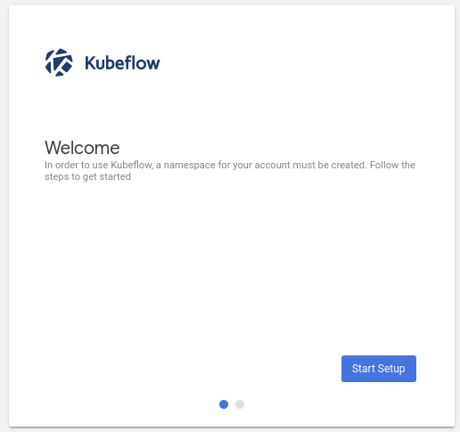

Create the namespace `ekskubeflow`.

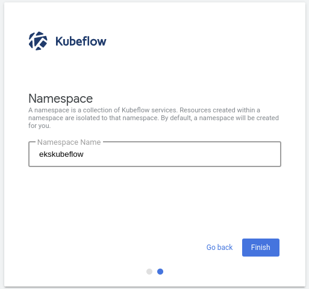

Create a new Notebook

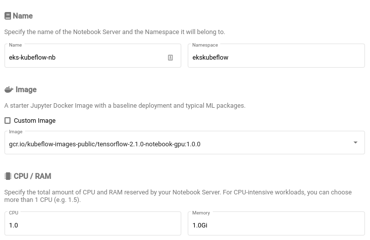

## Cleanup

The clean up process for this stack is broken up into a couple different steps that need to be completed in order so that orphaned resources aren't left behind.

